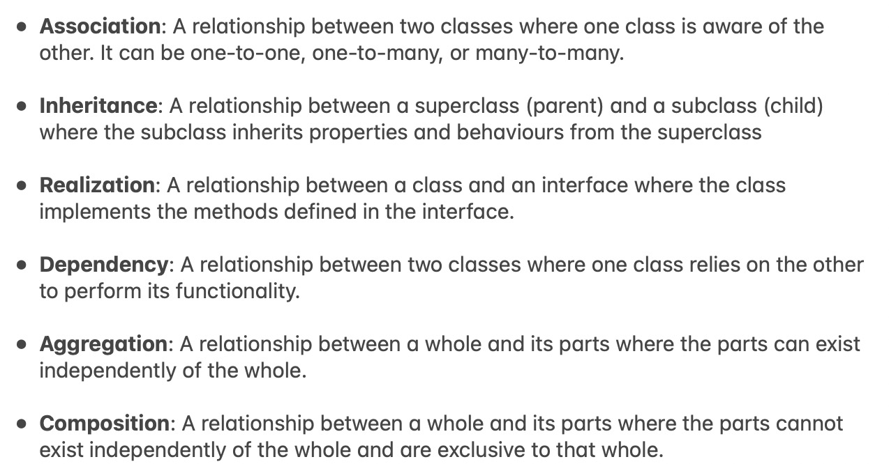

# UML Diagram

For package lab0 by Ole Pearse-Danker

----

<div style="display: flex;">
    
    
</div>

----

````mermaid
classDiagram
direction BT

class InsideState {
    - InsideState instance
    + getInstance(Scene) InsideState
    + drawInside() State
    + drawOutside() State
}

class OutsideState {
    - OutsideState instance
    + drawOutside() State
    + drawInside() State
    + getInstance(Scene) OutsideState
}

class State {
    <<abstract>>
    # Scene context
    # OutsideState outside
    # InsideState inside
    + abstract drawOutside() State
    + abstract drawInside() State
}

InsideState  --|>  State
OutsideState  --|>  State

Scene *--> State


class Animal {
  + sleep() void
  + eat() void
}
class BoundingBox {
    <<abstract>>
  - Point coordinates
  - int width
  - int height
  + drawBoundingBox() void
  # getWidth() int
  # setWidth(int) void
  # getCoordinates() Point
  # getHeight() int
  # setCoordinates(Point) void
  # setHeight(int) void
}
class Cat {
  - int legsHeight
  - int upperbodyWidth
  - Color primaryColor
  - Upperbody upperbody
  - int headWidth
  - int upperbodyHeight
  - Leg Rightleg
  - int headHeight
  - int legsWidth
  - Leg Leftleg
  - double boundingBoxRatio
  - Head head
  # Scene context
  + calculateAndSetHeight() void
  + getPrimaryColor() Color
  + draw() void
  + getUpperbody() Upperbody
  + height() int
  + address() Point
  + width() int
  + setPrimaryColor(Color) void
}
class ColorSlider {
  + setCurrentValue(int) void
}
class Drawing {
  - Graphics pen
  + set(Graphics) void
  + pen() Graphics
}
class DrawingArea {
  - Scene scene
  # paintComponent(Graphics) void
  + getScene() Scene
}
class DrawingTool {
  - DrawingArea drawing
  - constructDrawingArea() void
  + exit() void
  + actionPerformed(ActionEvent) void
  + main(String[]) void
}
class Ear {
  + draw() void
}
class Eye {
  + draw() void
}
class Foot {
  + draw() void
}
class Grid {
  - int height
  - int width
  - int size
  + draw() void
}
class Head {
  - int eyeHeight
  - Mouth mouth
  - int mouthWidth
  - int mouthHeight
  - Eye leftEye
  - Ear leftEar
  - int earHeight
  - Eye rightEye
  - Ear rightEar
  - int earWidth
  - int eyeWidth
  + draw() void
}
class Leg {
  - Foot Feet
  - int footWidth
  - int footHeight
  + draw() void
}
class LocatedRectangle {
<<Interface>>
  - doesNotIntersect(LocatedRectangle, int) boolean
  + height() int
  + leftOf(LocatedRectangle, int) boolean
  + address() Point
  + intersects(LocatedRectangle, int) boolean
  - below(LocatedRectangle, int) boolean
  + intersects(LocatedRectangle) boolean
  - above(LocatedRectangle, int) boolean
  + rightOf(LocatedRectangle, int) boolean
  + draw() void
  + width() int
}
class Main {
  + main(String[]) void
}
class Mouth {
  + int whiskerWidth
  + int whiskerHeight
  - Whisker[] whisker
  + draw() void
}
class PrimaryButton {
  - Color bgColor
  - Color textColor
}
class RandomNumber {
  + between(int, int) int
}
class Scene {
  - State graphicState
  - ArrayList~Cat~ cats
  - Color bgColor
  - String currentScene
  - boolean centerCat
  - int catCount
  + setBackgroundColor(Color) void
  + removeAllCats() void
  - drawCats() void
  + addCats(int) void
  + getAllCats() ArrayList~Cat~
  + getCats() ArrayList~Cat~
  + addCat() void
  + getBackgroundColor() Color
  + getCurrentScene() String
  + draw() void
  + setState(String) void
}
class ScreenInterface {
  + getScreenSize() Dimension
}
class Tail {
  - Color bgColor
  - Cat cat
  - Color tailColor2
  + setBgColor(Color) void
  + setTailColor(Color) void
  + getBgColor() Color
  + draw() void
  + getTailColor() Color
}
class Upperbody {
  - Color primaryColor
  - Cat cat
  - Tail tail
  + draw() void
  + getPrimaryColor() Color
  + setPrimaryColor(Color) void
  + getTail() Tail
}
class Whisker {
  + draw() void
}

Animal  -->  BoundingBox 
Cat  -->  Animal 
Cat "1" *--> "head 1" Head 
%% Cat  ..>  Head : «create»
Cat "1" *--> "Rightleg 1" Leg 
%% Cat  ..>  Leg : «create»
Cat  ..>  LocatedRectangle 
Cat "1" *--> "context 1" Scene 
Cat "1" *--> "upperbody 1" Upperbody 
%% Cat  ..>  Upperbody : «create»
%% DrawingArea  ..>  Grid : «create»
%% DrawingArea  ..>  Scene : «create»
DrawingArea "1" *--> "scene 1" Scene 
%% DrawingTool  ..>  ColorSlider : «create»
%% DrawingTool  ..>  DrawingArea : «create»
DrawingTool "1" *--> "drawing 1" DrawingArea 
%% DrawingTool  ..>  PrimaryButton : «create»
Ear  -->  BoundingBox 
Eye  -->  BoundingBox 
Foot  -->  BoundingBox 
Head  -->  BoundingBox 
Head "1" *--> "leftEar 1" Ear 
%% Head  ..>  Ear : «create»
Head "1" *--> "leftEye 1" Eye 
%% Head  ..>  Eye : «create»
%% Head  ..>  Mouth : «create»
Head "1" *--> "mouth 1" Mouth 
Leg  -->  BoundingBox 
%% Leg  ..>  Foot : «create»
Leg "1" *--> "Feet 1" Foot 
Mouth  -->  BoundingBox 
%% Mouth  ..>  Whisker : «create»
Mouth "1" *--> "whisker *" Whisker 
%% Scene  ..>  Cat : «create»
Scene "1" *--> "cats *" Cat 
Tail  -->  BoundingBox 
Tail "1" *--> "cat 1" Cat 
Upperbody  -->  BoundingBox 
Upperbody "1" *--> "cat 1" Cat 
%% Upperbody  ..>  Tail : «create»
Upperbody "1" *--> "tail 1" Tail 
Whisker  -->  BoundingBox

````